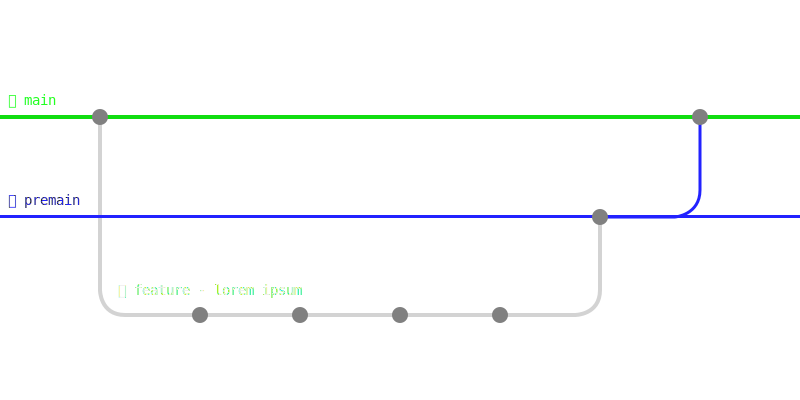

# Contribution à Aster.ia.ds

Bienvenue, et merci pour l'intérêt que vous portez pour Aster.ia.ds

Vous pouvez contribuer de plusieurs manières, voici une liste des types de contributions et comment y participer.

## ⌨️ Développement

Vous souhaitez contribuer au jeu n'hésitez surtout pas !
Vous pouvez regarder les issues éxistantes sur github et proposer un correctif,
ou alors si vous souhaitez aider sur des fonctionnalités contactées sur le [serveur Discord](http://discord.projetcohesion.info/) un `@OS` qui vous indiquera les prochains objectifs auxquels vous pourrez contribuer.

## 🪧 Signalement de problème

Simplement en jouant, ou en poussant le jeu à l'extrême etc, vous pouvez essayer de trouver des problèmes ou comportements louches et les signaler

Il vous suffira juste de renseigner une issue sur ce repo, après avoir vérifié qu'une autre identique ou similaire n'existe pas déjà.

## ✏️ Création d'assets et graphiques

Si blender ou d'autres outils de modélisation 3D, mais aussi 2D tel qu'illustrator ou photoshop vous passionne ou que vous souhaiteriez vous initier à ces outils sur un projet, vous pouvez faires des composants graphiques 2D ou 3D pour le jeu.

Actuellement, toutes les créations peuvent être utiles, telles que des icônes d'interfaces ou des skin de vaisseau, pour n'en cité qu'une partie

Si vous êtes intérréssé je vous invite à prendre contact avec l'association soit :
 - par mail [contact@projet-cohesion.info](mailto:contact@projet-cohesion.info)s
 - par discord, sur le serveur discord ([lien](http://discord.projetcohesion.info/)) et à mentionner un `@OS`

### Annexe :

Si vous contribuer sur ce git, assurez-vous de suivre un fonctionnement comme le suivant :

	

Pour proposer des modifications, il vous faudra d'abord créer votre branche ou fork depuis la branche main et demander une merge request vers la branche premain et ensuite un administrateur du projet validera ou non, avec une explication, la merge request, et les administrateur mettrons à jour vers la branche principal ensuite.

Pour les nom de branche veuillez suivre la convention suivante :
`feature/`,`fix/`,`hotfix/`
suivi d'une courte description

les commits et commentaires doivent être en anglais ou en français
